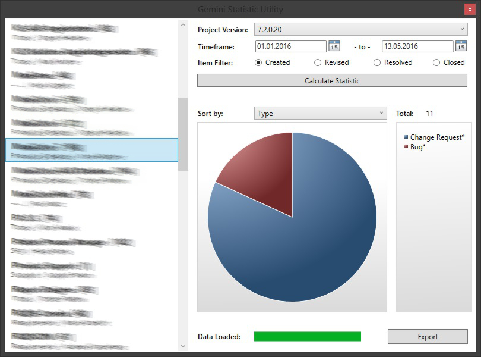

Gemini Statistic Utility (GSU)
========

This windows desktop app generates statistical evaluations, based on project data from the issue tracking system [Gemini](https://www.countersoft.com). It helps to keep an eye on project progress or to generate weekly reports. Core functionalities are:

* Providing fast access to Gemini projects
* Project item filter options
* Generating and visualising statistics
* Export result as excel file

The desktop app was programmed using C# + WPF and the Microsoft PRISM Libraries, to implement the architectural pattern MVVM and dependency injection. The WPFToolkit Library was used to visualize the charts and the EXCEL File export is done via the Open XML SDK 2.0

Setup
--------

Get the “gsu” zip file form the [latest release](https://github.com/krck/Gemini-Statistic-Utility/releases), extract the folder and start the “GeminiStatisticUtility.exe”. 

(No installation needed)

Usage
--------

The user-interface is deliberately minimal to allow a simple workflow: Select, filter, calculate and export.

* Login with a specific Gemini user or the Windows authentication.
* All Gemini projects are loaded automatically on startup and can be selected from the project list
* Apply filters to only consider project items relevant to the desired statistic (e.g.: newly created Bugs)
* Calculate the statistic
* Export the calculated data and diagram into an excel file 

Screenshot
--------

